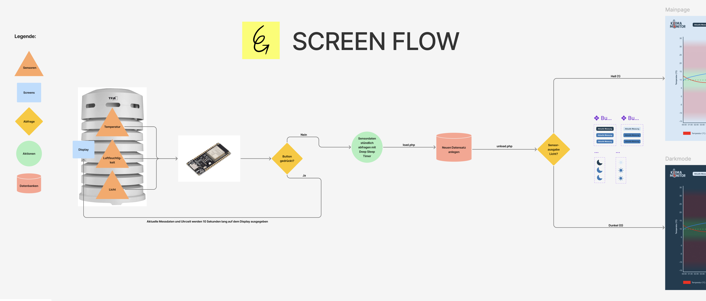
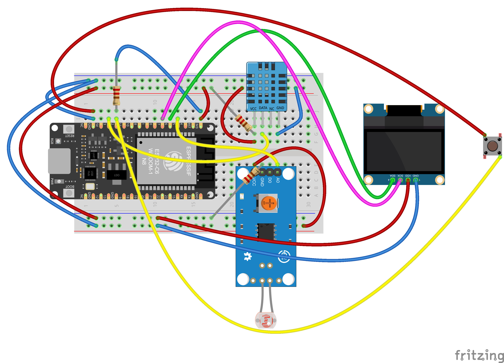
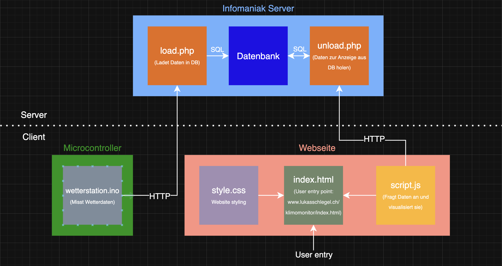

# Dokumentation Klimamonitor

## Projektbeschreibung
Ziel dieses Projekts war die Entwicklung einer autonomen Wetterstation auf Basis eines ESP32-C6-Mikrocontrollers. Die Station erfasst Temperatur, Luftfeuchtigkeit und Lichtintensität mithilfe von Sensoren und speichert die Messwerte automatisiert in einer Online-Datenbank. Um einen energiesparenden Betrieb im Aussenbereich zu ermöglichen, wurde der Mikrocontroller so programmiert, dass er im Deep-Sleep-Modus betrieben wird und nur stündlich für eine Messung aufwacht.

Zusätzlich wurde ein OLED-Display mit Taster integriert, das auf Knopfdruck die aktuellen Messwerte direkt an der Station anzeigt. Die gesamte Elektronik wurde in einem wetterfesten Gehäuse untergebracht, ergänzt durch ein 3D-gedrucktes Zusatzgehäuse für Display und Button.

Die Messdaten werden über eine eigene [Webseite](https://lukasschlegel.ch/klimamonitor/index.html) visualisiert. Dort können Nutzer zwischen Tages- und Wochenansicht wechseln, die aktuelle Messung abrufen und den Darkmode manuell oder automatisch aktivieren. Das Projekt verbindet Mikrocontroller-Programmierung, Webentwicklung, Datenbank-Integration und Hardwaredesign in einem praxisnahen Anwendungskontext.

## Vorgehensweise

### 1. Projektidee und Konzeption
Als erstes hatten wir die Idee, eine Wetterstation zu bauen. Durch zwei Interviews im näheren Umfeld konnten wir zusätzliche Bedürfnisse identifizieren und in die Planung aufnehmen. Anschliessend erstellten wir ein Flussdiagramm, um den Ablauf von der Datenerfassung über Sensoren bis hin zur Visualisierung auf einer Website zu veranschaulichen.
Darauf basierend entwickelten wir in Figma ein UX-Design, das den Aufbau und die Funktionsweise der Weboberfläche grafisch darstellt.

*Datenfluss der Wetterstation vom Sensor bis zur Webvisualisierung*

### 2. Sensoranbindung und Datenerfassung
Zuerst wurde der ESP32-C6 mit den Sensoren DHT11 (Temperatur und Luftfeuchtigkeit) und einem Lichtsensor LM393-Modul (Lichtmessung) auf einem Breadboard verbunden. Die Werte wurden dann mithilfe des seriellen Monitors in der Arduino IDE ausgelesen, um die Funktion der Sensoren zu verifizieren.

*Steckplan der Sensoren auf dem Breadboard*

### 3. Datenbankeinrichtung und Verknüpfung
Anschliessend wurde auf dem Infomaniak-Webserver eine Datenbank über phpMyAdmin erstellt. Die Tabelle enthielt Felder für Temperatur, Luftfeuchtigkeit, Lichtwert und Zeitstempel. Mit einem selbst geschriebenen PHP-Skript (load.php) wurde eine Schnittstelle entwickelt, über die die Sensordaten via HTTP POST an die Datenbank übertragen werden konnten.

*Logische Verknüpfung des Projekts*

### 4. Energiesparmodus (Deep Sleep)
Um den Energieverbrauch zu minimieren, wurde der Deep-Sleep-Modus des ESP32 implementiert. Der Mikrocontroller schaltet sich automatisch stündlich ein, führt eine Messung durch, sendet die Daten an den Server und geht danach wieder in den Tiefschlaf. Ziel war es, die Station später draussen mit Akku betreiben zu können.

### 5.	Wetterschutz und 3D-Aufsatz
Um die Elektronik vor Witterungseinflüssen zu schützen, wurde ein fertiges Thermometergehäuse beschafft, das sich aufgrund der Bauform ideal für Umgebungs-Messgeräte eignet, ohne die Messwerte zu verfälschen.

### 6.	Anzeigeeinheit mit Buttonsteuerung
Zusätzlich wurde ein OLED-Display integriert, das auf Knopfdruck (über GPIO2) eine aktuelle Einzelmessung anzeigt. Diese Funktion unterbricht temporär den Deep Sleep. Zur Montage des Displays am Gehäuse wurde zunächst ein Prototyp aus Karton gefertigt, anschliessend das finale Displaygehäuse im 3D-Druck erstellt und direkt an die Thermometerhülle geklebt. So konnten auch der Button und das Display wetterfest untergebracht werden.

*Prototyp für den 3D-Druck*

### 7.	Verkabelung und Lötarbeiten
Einige Verbindungen, insbesondere für Stromversorgung und Signalverbindungen zum Display, wurden fest verlötet, da sich Steckverbindungen beim Einbau als instabil erwiesen hatten.

*Löten am Projekt*

### 8.	Stromversorgung im Aussenbetrieb
Für den autonomen Betrieb im Freien wurde ein passender LiPo-Akku mit „Always-On“-Funktion beschafft. Der Akku ist per USB-C aufladbar und sollte die Wetterstation konstant mit Energie versorgen. In der Praxis zeigte sich jedoch, dass der Akku keine durchgehend stabilen 3 Volt liefern konnte, eine Spannung, die für die zuverlässige WLAN-Funktion des Mikrocontrollers notwendig ist. Aus diesem Grund wurde die konstante Stromversorgung per Kabel wieder eingesetzt, um einen stabilen Betrieb sicherzustellen.

### 9. Frontend & Datenvisualisierung
Abschliessend wurde eine Webseite mit HTML, CSS und JavaScript umgesetzt, auf der die Messdaten grafisch dargestellt werden. Die Ansicht lässt sich per Button zwischen Tages- und Wochenansicht umschalten. Zusätzlich kann die jeweils letzte Messung per Klick eingeblendet werden.
Die Seite enthält ausserdem ein manuell und automatisch schaltbares Darkmode-Feature: per Button (Mondsymbol oben rechts) oder automatisch bei Dunkelheit, sobald der Lichtwert unter eine definierte Schwelle fällt und dies in der Datenbank entsprechend vermerkt wird.

*Wetterstation im Aussenbetrieb und Innenleben der Station*

## Verworfene Lösungen & Umplanung
Während der Umsetzung des Projekts wurden verschiedene I/O-Pins für Sensoren und das Display ausprobiert. Dabei kam es zu einem unerwarteten Problem:
Die WLAN-Funktion des ESP32-C6 fiel komplett aus, sobald bestimmte Pins (z. B. GPIO6/7) verwendet wurden. Ursache war eine Überschneidung mit internen Flash/RF-Funktionen. Dieses Verhalten war nicht dokumentiert, was zu intensiver Fehlersuche führte.
Letztlich wurde das OLED-Display auf sichere Pins (GPIO 4 & 5) gelegt – danach funktionierte WLAN wieder zuverlässig. Auch die automatische Netzwerkanmeldung schlug mehrfach fehl, bis schliesslich ein Reset aller gespeicherten WLAN-Profile und ein manuelles Zurücksetzen des Boards (inkl. WiFi.disconnect(true, true)) das Problem lösten.

## Designentscheidungen & Hardware

Für den Aussenbetrieb wurde ein bereits bestehendes Thermometergehäuse gewählt, das sich durch seine Wetterschutz-Lamellen optimal für Temperatur- und Luftfeuchtigkeitsmessung eignet. Zusätzlich wurde ein eigenes Displaygehäuse entworfen, zuerst mit Karton getestet, dann mit dem 3D-Drucker realisiert. Das Display sowie der Taster konnten so direkt an der Messstation montiert und vor Regen geschützt werden.
Ein passender “Always-On”-Akku wurde beschafft, um dauerhaft Strom im Deep-Sleep-Betrieb zu gewährleisten.

## Fehlschläge & Debugging

Ein grosser Teil der Zeit floss in die Fehlersuche bei der WLAN-Verbindung, die mehrfach nicht funktionierte, obwohl SSID und Passwort korrekt waren. Die Ursache lag letztlich in:
	•	falscher Pinbelegung (GPIOs mit Systemfunktionen)
	•	falscher Frequenzband-Nutzung (5 GHz statt 2.4 GHz)
	•	Routerkonfigurationen (Smart Connect, Kanäle > 11)

Auch die Verwendung von analogen Pins (Lichtsensor) und die Auflösung (analogReadResolution) musste angepasst werden, damit stabile Messwerte erzielt wurden.

## Lerneffekt & neue Fähigkeiten

Durch die vielfältigen technischen Herausforderungen entstand ein starker Lerneffekt:
	•	Sicherer Umgang mit ESP32-C6, Deep-Sleep, RTC und GPIOs
	•	Verständnis von I2C-Kommunikation und Konflikten mit Systempins
	•	Anwendung von WiFi-Debugging, Statuscodes und Netzwerkscan
	•	Umsetzung von PHP-Backends für IoT-Datenempfang
	•	Aufbau eines Chart.js-Dashboards mit Umschaltlogik, Live-Daten und Darkmode
	•	Einsatz von 3D-Druck-Prototyping und Gehäuseintegration
	•	Nutzung von internem Pullup für Buttons ohne externe Bauteile

## Aufgabenverteilung & Tools

Das Projekt wurde eigenständig umgesetzt – von der Hardwareverkabelung über die Serveranbindung bis hin zur Weboberfläche.
Zur Unterstützung kamen verschiedene Hilfsmittel zum Einsatz, darunter:
	•	ChatGPT für Fehlersuche, Codekorrekturen und konzeptionelle Unterstützung
	•	Arduino IDE zum Programmieren und Testen
	•	phpMyAdmin für Datenbankpflege
	•	Figma & 3D-Drucker für Design und Gehäuseentwicklung

## Known Bugs

	•	Bei schlechtem WLAN-Empfang kann die Datenübertragung fehlschlagen – hierfür wäre eine Retry-Logik oder lokale Zwischenspeicherung sinnvoll
	•	Bei langem Deep Sleep kann es zu Zeitabweichungen kommen (fehlende RTC-Zeitkorrektur via NTP bei jedem Start)
